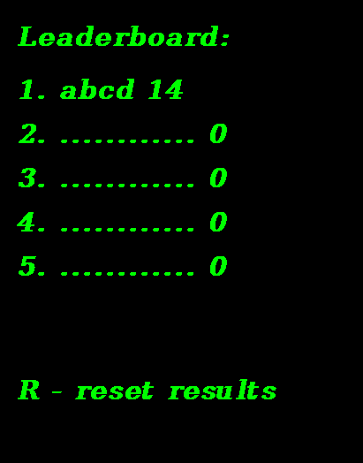
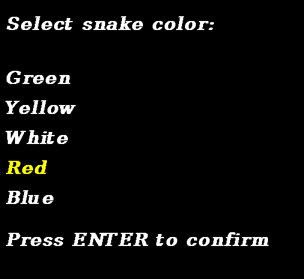

# Snake game

## Run game

```sh
$ pip install pygame
$ python main.py
```

## Main menu

Start page contains game instructions and redirections to settings and leaderboard. Start the game by pressing ENTER key.

<p align="center">

</p>

## Gameplay

Move snake with arrows. Current score is shown in upper left corner. Press P key to pause the game.

<p align="center">


## Highscore

If your score is in top 5 results, you are asked to enter your name for leaderboard.

<p align="center">

</p>

Leaderboard can be cleaned by pressing R key.

<p align="center">

</p>

## Settings

In the settings, the color of the snake can be changed.

<p align="center">

</p>
